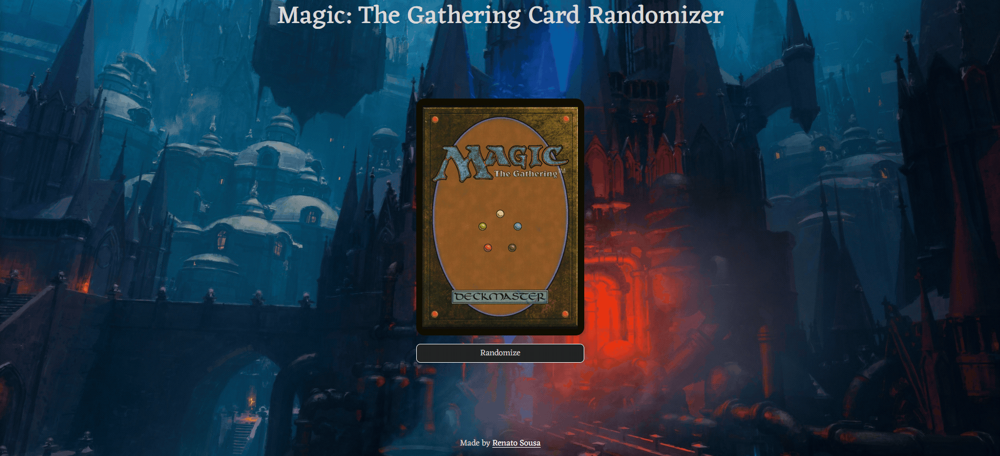

My interest in computing and technology started when I got my first computer as a child, I started playing MMORPGs and using programs and always wondered how those games and programs were made, I even used to create servers for the game MU Online, but nothing more than that. After working with lots of Excel spreadsheets (thanks, IF function), I realized I wanted to do more than just formulas and functions, and that's when I decided to dive right into the programming field.     

# Projects

<table>
  
  <tr>
    <td width="50%" valign="top">
      <h3 align="center">Top Albums Finder</h3>
         
        
         
        

          
  </a>
      

        
See the top albums for an artist based on the number of listeners on Last.fm, ordered by popularity.

    </td>
    <td width="50%" valign="top">
      <h3 align="center">Magic: The Gathering Card Randomizer</h3>
         
      
         
        

          
  
  </a>
      

        
Discover random Magic: The Gathering cards with just a click of a button.

    </td>
  </tr>
  
  <tr>
    <td width="50%" valign="top">
      <h3 align="center">Hades - Select Your Character</h3>
       
        
       
        

  
  </a>
      

        
A "select your character" screen based on the Hades game.

    </td>
    <td width="50%" valign="top">
      <h3 align="center">Bia Cabeleireira</h3>
         
        
         
        

          
  
  </a>
      

        
Stylish hair salon specializing in cuts, colors, and treatments for a confident look.

    </td>
  </tr>
</table>

# Languages and Tools

<table>
<td width="50%">

</td>
<td width="50%">
</td>
</table>

# Others

